<div align="center">

# 💧 Water Quality Monitoring & Leak Detection System

<p align="center">
  
  
  
  
  
  
</p>

<p align="center">
  <strong>Real-time water quality monitoring and intelligent leak detection powered by IoT with modern glassmorphism UI</strong>
</p>

<p align="center">
  <a href="#-features">Features</a> •
  <a href="#-system-architecture">Architecture</a> •
  <a href="#-hardware-setup">Hardware</a> •
  <a href="#-installation">Installation</a> •
  <a href="#-usage">Usage</a> •
  <a href="#-documentation">Docs</a>
</p>

</div>

---

## 🌟 Features

<table>
  <tr>
    <td>
      <h3>💧 Water Quality Monitoring</h3>
      <ul>
        <li>Real-time TDS (Total Dissolved Solids) measurement</li>
        <li>Temperature-compensated readings</li>
        <li>Quality status indicators (Good/Poor/Too Low)</li>
        <li>Configurable threshold alerts (50-500 ppm)</li>
      </ul>
    </td>
    <td>
      <h3>🚰 Flow Rate Tracking</h3>
      <ul>
        <li>Precise flow rate measurement (D6 turbine sensor)</li>
        <li>Total volume calculation in real-time</li>
        <li>Expected vs actual flow comparison</li>
        <li>Interactive flow visualization charts</li>
      </ul>
    </td>
  </tr>
  <tr>
    <td>
      <h3>🔍 Physical Leak Detection</h3>
      <ul>
        <li>Direct water drop detection (D5 sensor)</li>
        <li>Short-circuit based leak sensing</li>
        <li>Instant critical alerts with LED flash</li>
        <li>Automatic leak status tracking</li>
      </ul>
    </td>
    <td>
      <h3>📊 Modern Dashboard (PWA)</h3>
      <ul>
        <li>Glassmorphism UI with dark gradient</li>
        <li>Installable Progressive Web App</li>
        <li>Live data updates every 15 seconds</li>
        <li>Smooth framer-motion animations</li>
      </ul>
    </td>
  </tr>
  <tr>
    <td>
      <h3>🔔 Smart Notifications</h3>
      <ul>
        <li>Service worker-based push notifications</li>
        <li>Works on locked/background screens</li>
        <li>Sound alerts for critical issues</li>
        <li>De-duplication to prevent spam</li>
      </ul>
    </td>
    <td>
      <h3>☁️ Cloud Integration</h3>
      <ul>
        <li>Firebase Realtime Database sync</li>
        <li>ThingSpeak analytics platform</li>
        <li>Historical data storage</li>
        <li>60-second online/offline detection</li>
      </ul>
    </td>
  </tr>
</table>

---

## 🏗️ System Architecture

```mermaid
graph TB
    subgraph Hardware["🔧 Hardware Layer"]
        A[TDS Sensor] --> E[NodeMCU ESP8266]
        B[Flow Sensor] --> E
        C[IR Sensor] --> E
        D[LED Indicator] --> E
    end

    subgraph Cloud["☁️ Cloud Services"]
        E -->|WiFi| F[Firebase Realtime DB]
        E -->|HTTP| G[ThingSpeak]
    end

    subgraph Frontend["💻 Web Dashboard"]
        F -->|Real-time Sync| H[Next.js App]
        H --> I[Charts & Analytics]
        H --> J[Alerts System]
        H --> K[Settings Panel]
    end

    style E fill:#ff6b6b
    style F fill:#ffa500
    style G fill:#4ecdc4
    style H fill:#1a1a1a
```



---

## 🔌 Hardware Setup

### 📦 Required Components

| Component          | Quantity | Description                            |
| ------------------ | -------- | -------------------------------------- |
| 🖥️ NodeMCU ESP8266 | 1        | Main microcontroller with WiFi         |
| 💧 TDS Sensor      | 1        | Water quality measurement (0-1000 ppm) |
| 🌊 Flow Sensor     | 1        | Water flow turbine sensor              |
| 📡 IR Sensor       | 1        | Pulse detection for flow sensor        |
| 💡 LED             | 1        | Status indicator                       |
| 🔌 Jumper Wires    | Multiple | Connections                            |
| 🔋 Power Supply    | 1        | 5V USB or external power               |

### 🔧 Pin Configuration

```cpp
TDS Sensor  → A0 (Analog Pin)
IR Sensor   → D5 (Digital Pin with interrupt)
LED         → D4 (Built-in LED)
```

### 📐 Wiring Diagram

<details>
<summary>Click to view detailed wiring instructions</summary>

**TDS Sensor:**

- VCC → 3.3V
- GND → GND
- Signal → A0

**Flow Sensor (Turbine + IR):**

- VCC → 5V (external if available)
- GND → GND
- Signal → D6

**Leak Detection Sensor:**

- Terminal 1 → D5
- Terminal 2 → GND
- (Forms short circuit when water drops detected)

**LED (Built-in):**

- Uses `LED_BUILTIN` (NodeMCU onboard LED)
- Turns ON when WiFi connected
- Blinks during alerts

</details>

---

## 🚀 Installation

### 📋 Prerequisites

<table>
  <tr>
    <td><strong>For Arduino/Hardware:</strong></td>
    <td><strong>For Dashboard:</strong></td>
  </tr>
  <tr>
    <td>
      <ul>
        <li>Arduino IDE or PlatformIO</li>
        <li>ESP8266 Board Package</li>
        <li>Firebase ESP8266 Library</li>
        <li>ESP8266WiFi Library</li>
        <li>ESP8266HTTPClient Library</li>
      </ul>
    </td>
    <td>
      <ul>
        <li>Node.js (v18 or higher)</li>
        <li>npm or yarn</li>
        <li>Firebase account</li>
        <li>ThingSpeak account (optional)</li>
        <li>Modern browser with PWA support</li>
      </ul>
    </td>
  </tr>
</table>

### 1️⃣ Clone the Repository

```bash
git clone https://github.com/deepaksoni47/Water-Quality-Monitoring-and-Leak-Detection.git
cd Water-Quality-Monitoring-and-Leak-Detection
```

### 2️⃣ Hardware Setup (Arduino)

#### Install Required Libraries

```bash
# Using Arduino IDE Library Manager:
# - Firebase ESP8266 Client
# - ESP8266WiFi
# - ESP8266HTTPClient
```

#### Configure Credentials

1. Navigate to `arduino/water_monitoring_system/`
2. Copy `secrets.h.example` to `secrets.h`
3. Add your credentials:

```cpp
// WiFi Credentials
#define WIFI_SSID "Your_WiFi_Name"
#define WIFI_PASSWORD "Your_WiFi_Password"

// Firebase Configuration
#define FIREBASE_API_KEY "your_firebase_api_key"
#define FIREBASE_DATABASE_URL "https://your-project.asia-southeast1.firebasedatabase.app"
#define FIREBASE_USER_EMAIL "your-email@example.com"
#define FIREBASE_USER_PASSWORD "your_firebase_password"

// ThingSpeak Configuration (Optional)
#define THINGSPEAK_API_KEY "your_thingspeak_api_key"
```

#### Upload to NodeMCU

```bash
# Open water_monitoring_system.ino in Arduino IDE
# Select Board: NodeMCU 1.0 (ESP-12E Module)
# Select Port: [Your COM Port]
# Click Upload
```

### 3️⃣ Dashboard Setup (Next.js)

#### Install Dependencies

```bash
cd water-monitor-dashboard
npm install
```

#### Configure Firebase

1. Create a Firebase project at [Firebase Console](https://console.firebase.google.com/)
2. Enable Realtime Database
3. Create `src/lib/firebase.ts` with your config:

```typescript
import { initializeApp } from "firebase/app";
import { getDatabase } from "firebase/database";

const firebaseConfig = {
  apiKey: "your_api_key",
  authDomain: "your-project.firebaseapp.com",
  databaseURL: "https://your-project.firebaseio.com",
  projectId: "your-project-id",
  storageBucket: "your-project.appspot.com",
  messagingSenderId: "your_sender_id",
  appId: "your_app_id",
};

const app = initializeApp(firebaseConfig);
export const database = getDatabase(app);
```

#### Run Development Server

```bash
npm run dev
```

Open [http://localhost:3000](http://localhost:3000) in your browser 🎉

#### Enable Notifications (Recommended)

1. Click **"Enable Notifications"** banner at the top
2. Allow notifications when prompted by browser
3. You'll receive instant alerts for leaks and water quality issues!

See [NOTIFICATION_QUICKSTART.md](NOTIFICATION_QUICKSTART.md) for details.

### 4️⃣ Deploy Firebase Rules

```bash
cd firebase
firebase deploy --only database
```

---

## 📱 Usage

### 🎮 Dashboard Controls

<table>
  <tr>
    <th>Feature</th>
    <th>Description</th>
  </tr>
  <tr>
    <td><strong>📊 Current Readings</strong></td>
    <td>View real-time TDS, flow rate, and total volume</td>
  </tr>
  <tr>
    <td><strong>📈 Charts</strong></td>
    <td>Analyze trends with interactive TDS and Flow charts</td>
  </tr>
  <tr>
    <td><strong>🔔 Alerts</strong></td>
    <td>Monitor system alerts and notifications</td>
  </tr>
  <tr>
    <td><strong>⚙️ Settings</strong></td>
    <td>Configure expected flow rate and thresholds</td>
  </tr>
  <tr>
    <td><strong>📡 System Status</strong></td>
    <td>Check device connection and last update time</td>
  </tr>
</table>

### 🎯 Calibration

#### TDS Sensor Calibration

1. Use a calibration solution (e.g., 1413 µS/cm)
2. Adjust `TDS_CALIBRATION_FACTOR` in `config.h`
3. Formula: `TDS (ppm) = EC (µS/cm) × 0.5`

#### Flow Sensor Calibration

1. Measure actual water volume over time
2. Adjust `FLOW_CALIBRATION_FACTOR` in `config.h`
3. Typical range: 4.5 - 7.5 (depends on turbine model)

See [Calibration Guide](docs/calibration-guide.md) for detailed instructions.

---

## 📊 Data Structure

### Firebase Realtime Database Schema

```json
{
  "readings": {
    "current": {
      "tds": 250.5,
      "flowRate": 2.15,
      "totalVolume": 125.8,
      "expectedFlow": 2.0,
      "timestamp": 1699632000,
      "status": "NORMAL"
    },
    "history": {
      "timestamp1": { "..." },
      "timestamp2": { "..." }
    }
  },
  "alerts": {
    "timestamp1": {
      "message": "Water quality issue...",
      "timestamp": 1699632000,
      "tds": 600.5,
      "flowRate": 1.8
    }
  },
  "system": {
    "expectedFlowRate": 2.0,
    "lastUpdate": 1699632000,
    "online": true
  },
  "notifications": {
    "latest": {
      "message": "System normal",
      "timestamp": 1699632000,
      "unread": false
    }
  }
}
```

---

## 🎨 Screenshots

<div align="center">

### 🖥️ Dashboard Overview


### 📊 Analytics & Charts


### 🔔 Alert System


</div>

---

## 📚 Documentation

| Document                                          | Description                      |
| ------------------------------------------------- | -------------------------------- |
| [🔧 Hardware Setup](docs/hardware-setup.md)       | Detailed hardware assembly guide |
| [📏 Calibration Guide](docs/calibration-guide.md) | Sensor calibration instructions  |
| [🔌 API Documentation](docs/api-documentation.md) | Firebase API reference           |
| [🚀 Deployment Guide](firebase/README.md)         | Cloud deployment instructions    |

---

## 🛠️ Tech Stack

<div align="center">

### Hardware


### Frontend


### Backend & Cloud


### Tools


</div>

---

## 🔐 Security

- ⚠️ **Never commit `secrets.h`** to version control
- 🔒 Use Firebase Security Rules (see `firebase/database.rules.json`)
- 🛡️ Enable Firebase Authentication
- 🔑 Rotate API keys regularly
- 📝 Review access logs periodically

---

## 🐛 Troubleshooting

<details>
<summary><strong>❌ WiFi Connection Failed</strong></summary>

- Check SSID and password in `secrets.h`
- Ensure 2.4GHz WiFi (ESP8266 doesn't support 5GHz)
- Verify router is within range
- Check Serial Monitor for error messages

</details>

<details>
<summary><strong>❌ Firebase Connection Error</strong></summary>

- Verify Firebase credentials in `secrets.h`
- Check database rules allow read/write
- Ensure internet connection is stable
- Verify Firebase project is active

</details>

<details>
<summary><strong>❌ Inaccurate Sensor Readings</strong></summary>

- Calibrate TDS sensor with standard solution
- Adjust calibration factors in `config.h`
- Check sensor connections and wiring
- Ensure sensors are properly submerged

</details>

<details>
<summary><strong>❌ Dashboard Not Updating</strong></summary>

- Check if NodeMCU is online (System Status panel)
- Verify Firebase connection
- Clear browser cache
- Check browser console for errors

</details>

---

## 🗺️ Roadmap

- [x] Basic water quality monitoring
- [x] Flow rate measurement
- [x] Leak detection algorithm
- [x] Real-time dashboard
- [x] Firebase integration
- [x] Browser push notifications
- [ ] Mobile app (React Native)
- [ ] Email/SMS notifications
- [ ] Machine learning predictions
- [ ] Multi-sensor support
- [ ] Historical data export
- [ ] Voice assistant integration (Alexa/Google Home)

---

## 🤝 Contributing

Contributions are welcome! Please feel free to submit a Pull Request.

1. Fork the repository
2. Create your feature branch (`git checkout -b feature/AmazingFeature`)
3. Commit your changes (`git commit -m 'Add some AmazingFeature'`)
4. Push to the branch (`git push origin feature/AmazingFeature`)
5. Open a Pull Request

---

## 📄 License

This project is open source and available under the [MIT License](LICENSE).

---

## 👨‍💻 Author

<div align="center">

**Deepak Soni**

[](https://github.com/deepaksoni47)
[](mailto:deepaksoni23022004@gmail.com)

</div>

---

## 🙏 Acknowledgments

- ESP8266 Community for excellent documentation
- Firebase team for real-time database
- ThingSpeak for IoT analytics platform
- Next.js team for the amazing framework
- All contributors and supporters

---

<div align="center">

### ⭐ Star this repository if you find it helpful!

Made with ❤️ and ☕ by [Deepak Soni](https://github.com/deepaksoni47)

**[↑ Back to Top](#-water-quality-monitoring--leak-detection-system)**

</div>
